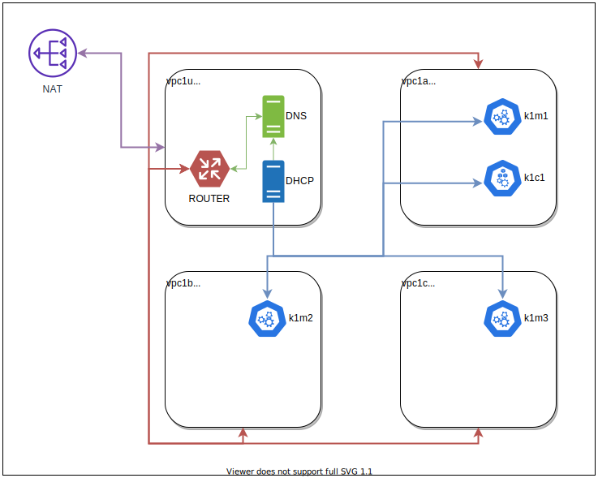

CLOUD-LIKE VPC ENVIRONMENT DONE IN LIBVIRT / QEMU ON LINUX
==========================================================

## 1. PURPOSE

Use local resources (cpu, memory and disk storage) for creating VPC-like fully-automated environment for research and development.

## 2. ARCHITECTURE



## 3. REQUIREMENTS

### 3.1 SOFTWARE

__System packages__:
- cdrkit (for mkisofs)
- cloud-utils (for preparing VM initialization media)
- gcc
- git
- gnumake
- go (for building extra terraform providers)
- libffi (devel)
- libvirt (devel)
- libxslt (devel)
- openssl (devel)
- pipenv
- pkgconfig
- python3
- rsync (needed by ansible)

__Base software__:
- [packer (Hashicorp)](https://releases.hashicorp.com/packer/)
- [terraform (Hashicorp)](https://releases.hashicorp.com/terraform/)
- [terragrunt (Github)](https://github.com/gruntwork-io/terragrunt/releases)

__Terraform providers__:
- [terraform-provider-external (Hashicorp)](https://releases.hashicorp.com/terraform-provider-external/)
- [terraform-provider-libvirt (Github)](https://github.com/dmacvicar/terraform-provider-libvirt/releases)
- [terraform-provider-local (Hashicorp)](https://releases.hashicorp.com/terraform-provider-local/)
- [terraform-provider-null (Hashicorp)](https://releases.hashicorp.com/terraform-provider-null/)
- [terraform-provider-template (Hashicorp)](https://releases.hashicorp.com/terraform-provider-template/)

__Python packages__:
- ansible
- ipaddress
- pyyaml
- terraform\_external\_data

### 3.2 INCLUDED AUTOMATION

If you're using [NixOS](https://nixos.org/) you can just enter Nix shell and continue from there:
```bash
$ nix-shell
```

Otherwise just install prerequisites listed above [3.1](#31-software) as you would normally do in your Linux distro.

All the "Hashicorp" providers can be installed manually or by `terraform` itself. The "libvirt" provider has to be built from source.

For your convenience we've included `makefile` scripts that can install and build all the requirements. If you've decided to go with the "makefile" way,
just make sure that your `$GOPATH` and `$PATH` variables point to existing directories beforehand:

```bash
$ cat ~/.profile
```
```bash
...
export GOPATH="$HOME/go"
export PATH="$GOPATH/bin:$PATH"
...
```

To install requirements  run:

```bash
$ make requirements _GOPATH_=~/go
```
[>>> CONSOLE OUTPUT <<<](docs/make-requirements-output.md)

To verify golang binaries run:

```bash
$ ls -1F ~/go/bin/
```
```
packer@
packer-1.5.1*
terraform@
terraform-0.12.19*
terraform-provider-external@
terraform-provider-external-1.2.0*
terraform-provider-libvirt@
terraform-provider-libvirt-0.6.1*
terraform-provider-local@
terraform-provider-local-1.4.0*
terraform-provider-null@
terraform-provider-null-2.1.2*
terraform-provider-template@
terraform-provider-template-2.1.2*
terragrunt@
terragrunt-0.21.11*
```

To verify python packages run:

```bash
$ ls -1F .venv/lib/python3.7/site-packages/
```
```
ansible/
ansible-2.9.4.dist-info/
ansible_test/
cffi/
cffi-1.13.2.dist-info/
_cffi_backend.cpython-37m-x86_64-linux-gnu.so*
cryptography/
cryptography-2.8.dist-info/
easy_install.py
ipaddress-1.0.23.dist-info/
ipaddress.py
jinja2/
Jinja2-2.11.0.dist-info/
markupsafe/
MarkupSafe-1.1.1.dist-info/
pip/
pip-20.0.2.dist-info/
pkg_resources/
__pycache__/
pycparser/
pycparser-2.19.dist-info/
PyYAML-5.3.dist-info/
setuptools/
setuptools-45.2.0.dist-info/
six-1.14.0.dist-info/
six.py
terraform_external_data/
terraform_external_data-1.0.1.dist-info/
wheel/
wheel-0.34.2.dist-info/
yaml/
```

```bash
$ PIPENV_IGNORE_VIRTUALENVS=1 PIPENV_VENV_IN_PROJECT=1 pipenv run pip list
```
```
Package                 Version
----------------------- ----------
ansible                 2.9.4
certifi                 2019.6.16
cffi                    1.13.2
cryptography            2.8
ipaddress               1.0.23
Jinja2                  2.11.0
MarkupSafe              1.1.1
pip                     20.0.2
pipenv                  2018.11.26
pycparser               2.19
PyYAML                  5.3
setuptools              45.2.0
six                     1.14.0
terraform-external-data 1.0.1
virtualenv              16.4.3
virtualenv-clone        0.5.3
wheel                   0.34.2
```

## 4. USAGE

### 4.1 CREATE VPC ENVIRONMENT

Example config `LIVE/vpc1/terragrunt.hcl`:
```hcl
include {
    path = "${find_in_parent_folders()}"
}

terraform {
    source = "../../terraform/vpc/"
}

inputs = {
    vpc_id = "vpc1"

    ssh_keys = [
        file("~/.ssh/id_ed25519.pub"),
    ]

    pool_directory = "/stor/libvirt/fake_vpc"

    base_images = {
        utl = "../../../../../packer/utl/.cache/output/packer-utl.qcow2"
        vpc = "../../../../../packer/vpc/.cache/output/packer-vpc.qcow2"
    }

    networks = [
        {
            name    = "vpc1gw"
            subnet  = "10.69.0.0/16"
            macaddr = "52:54:00:69:00:%02x"
        },
        {
            name    = "vpc1a"
            subnet  = "10.10.1.0/24"
            macaddr = "52:54:00:10:01:%02x"
        },
        {
            name    = "vpc1b"
            subnet  = "10.10.2.0/24"
            macaddr = "52:54:00:10:02:%02x"
        },
        {
            name    = "vpc1c"
            subnet  = "10.10.3.0/24"
            macaddr = "52:54:00:10:03:%02x"
        },
    ]

    utl_hosts = [
        {
            name   = "vpc1u"
            vcpu   = 1
            memory = "512"
        },
    ]

    vpc_hosts = [
        {
            name    = "vpc1a"
            vcpu    = 4
            memory  = "3096"
            storage = "128849018880"  # 120GiB
        },
        {
            name    = "vpc1b"
            vcpu    = 4
            memory  = "3096"
            storage = "128849018880"  # 120GiB
        },
        {
            name    = "vpc1c"
            vcpu    = 4
            memory  = "3096"
            storage = "128849018880"  # 120GiB
        },
    ]
}
```

To deploy "vpc1" environment run (packer images will be built automatically):
```bash
$ make vpc-apply
```
[>>> CONSOLE OUTPUT <<<](docs/vpc-apply-output.md)

To list running libvirt domains:
```bash
$ sudo virsh list
```
```
 Id   Name    State
-----------------------
 5    vpc1u   running
 6    vpc1c   running
 7    vpc1b   running
 8    vpc1a   running
```

### 4.2 CREATE K8S ENVIRONMENT

Example config `LIVE/k8s1/terragrunt.hcl`:
```hcl
include {
    path = "${find_in_parent_folders()}"
}

terraform {
    source = "../../terraform/k8s/"
}

inputs = {
    k8s_id = "k1"

    availability_zones = [
        {
            name   = "vpc1a"
            subnet = "10.10.1.0/24"
        },
        {
            name   = "vpc1b"
            subnet = "10.10.2.0/24"
        },
        {
            name   = "vpc1c"
            subnet = "10.10.3.0/24"
        },
    ]

    ssh_keys = [
        file("~/.ssh/id_ed25519.pub"),
    ]

    master = {
        count   = 3
        vcpu    = 2
        memory  = "2048"
        image   = "../../../../../packer/k8s/.cache/output/packer-k8s.qcow2"
        storage = "17179869184"  # 16GiB
    }

    compute = {
        count   = 1
        vcpu    = 2
        memory  = "1024"
        image   = "../../../../../packer/k8s/.cache/output/packer-k8s.qcow2"
        storage = "17179869184"  # 16GiB
    }
}
```

To deploy "k8s1" environment run (packer image will be built automatically):
```bash
$ make k8s-apply
```
[>>> CONSOLE OUTPUT <<<](docs/k8s-apply-output.md)

To list running libvirt (nested) domains:
```bash
$ make ssh-utl
```
```
Warning: Permanently added '10.69.0.10' (ECDSA) to the list of known hosts.
Welcome to Ubuntu 18.04.4 LTS (GNU/Linux 4.15.0-74-generic x86_64)

 * Documentation:  https://help.ubuntu.com
 * Management:     https://landscape.canonical.com
 * Support:        https://ubuntu.com/advantage

  System information as of Sun Feb 16 19:45:54 UTC 2020

  System load:  0.0               Users logged in:     0
  Usage of /:   14.8% of 9.52GB   IP address for ens3: 10.69.0.10
  Memory usage: 23%               IP address for ens4: 10.10.1.2
  Swap usage:   0%                IP address for ens5: 10.10.2.2
  Processes:    86                IP address for ens6: 10.10.3.2


8 packages can be updated.
8 updates are security updates.


Last login: Sun Feb 16 19:15:00 2020 from 10.69.0.1
```
```bash
ubuntu@vpc1u:~$ ssh vpc1a sudo virsh list
```
```
Warning: Permanently added 'vpc1a,10.10.1.10' (ECDSA) to the list of known hosts.
 Id    Name                           State
----------------------------------------------------
 1     k1c1                           running
 2     k1m1                           running
```
```bash
ubuntu@vpc1u:~$ ssh vpc1b sudo virsh list
```
```
Warning: Permanently added 'vpc1b,10.10.2.10' (ECDSA) to the list of known hosts.
 Id    Name                           State
----------------------------------------------------
 1     k1m2                           running
```
```bash
ubuntu@vpc1u:~$ ssh vpc1c sudo virsh list
```
```
Warning: Permanently added 'vpc1c,10.10.3.10' (ECDSA) to the list of known hosts.
 Id    Name                           State
----------------------------------------------------
 1     k1m3                           running
```

### 4.3 DEPLOY KUBERNETES (USING KUBELO)

To prepare ansible inventory run:
```bash
$ cat >kubelo/kubelo.ini <<EOF
[all:vars]
cluster_name=k1
ansible_user=ubuntu
cloud_provider=

[bastion]
vpc1u ansible_host=10.69.0.10

[etcd]
k1m1
k1m2
k1m3

[master]
k1m1
k1m2
k1m3

[compute]
k1c1
EOF
```

To deploy kubernetes:
```bash
$ (cd kubelo/ && ansible-playbook kubelo.yml)
```
[>>> CONSOLE OUTPUT <<<](docs/kubelo-output.md)


To list nodes and pods:
```bash
$ make ssh-utl
```
```
Warning: Permanently added '10.69.0.10' (ECDSA) to the list of known hosts.
Welcome to Ubuntu 18.04.4 LTS (GNU/Linux 4.15.0-74-generic x86_64)

 * Documentation:  https://help.ubuntu.com
 * Management:     https://landscape.canonical.com
 * Support:        https://ubuntu.com/advantage

  System information as of Sun Feb 16 19:15:00 UTC 2020

  System load:  0.0               Users logged in:     0
  Usage of /:   14.8% of 9.52GB   IP address for ens3: 10.69.0.10
  Memory usage: 23%               IP address for ens4: 10.10.1.2
  Swap usage:   0%                IP address for ens5: 10.10.2.2
  Processes:    86                IP address for ens6: 10.10.3.2


8 packages can be updated.
8 updates are security updates.


Last login: Sun Feb 16 18:39:00 2020 from 10.69.0.1
```
```bash
ubuntu@vpc1u:~$ ssh k1m1 -t sudo -i kubectl get nodes
```
```
Warning: Permanently added 'k1m1,10.10.1.246' (ECDSA) to the list of known hosts.
NAME              STATUS   ROLES    AGE     VERSION
k1c1.vpc1.local   Ready    <none>   4m27s   v1.14.6
k1m1.vpc1.local   Ready    master   8m35s   v1.14.6
k1m2.vpc1.local   Ready    master   5m48s   v1.14.6
k1m3.vpc1.local   Ready    master   6m2s    v1.14.6
Connection to k1m1 closed.
```
```bash
ubuntu@vpc1u:~$ ssh k1m1 -t sudo -i kubectl get pods --all-namespaces
```
```
Warning: Permanently added 'k1m1,10.10.1.246' (ECDSA) to the list of known hosts.
NAMESPACE     NAME                                      READY   STATUS    RESTARTS   AGE
kube-system   coredns-584795fc57-27x9j                  1/1     Running   0          8m10s
kube-system   coredns-584795fc57-q5bfv                  1/1     Running   0          8m11s
kube-system   kube-apiserver-k1m1.vpc1.local            1/1     Running   0          7m33s
kube-system   kube-apiserver-k1m2.vpc1.local            1/1     Running   0          5m58s
kube-system   kube-apiserver-k1m3.vpc1.local            1/1     Running   0          6m11s
kube-system   kube-controller-manager-k1m1.vpc1.local   1/1     Running   0          7m36s
kube-system   kube-controller-manager-k1m2.vpc1.local   1/1     Running   0          5m57s
kube-system   kube-controller-manager-k1m3.vpc1.local   1/1     Running   0          6m11s
kube-system   kube-flannel-ds-amd64-4xf2z               1/1     Running   0          5m59s
kube-system   kube-flannel-ds-amd64-jwpfs               1/1     Running   0          8m11s
kube-system   kube-flannel-ds-amd64-npcg4               1/1     Running   0          4m37s
kube-system   kube-flannel-ds-amd64-xlz5x               1/1     Running   0          6m11s
kube-system   kube-proxy-7pr5d                          1/1     Running   0          8m11s
kube-system   kube-proxy-gwfss                          1/1     Running   0          4m37s
kube-system   kube-proxy-hwtjz                          1/1     Running   0          5m59s
kube-system   kube-proxy-w5j59                          1/1     Running   0          6m11s
kube-system   kube-scheduler-k1m1.vpc1.local            1/1     Running   1          7m45s
kube-system   kube-scheduler-k1m2.vpc1.local            1/1     Running   0          5m57s
kube-system   kube-scheduler-k1m3.vpc1.local            1/1     Running   0          6m11s
kube-system   tiller-deploy-7b98f7c844-768jz            1/1     Running   0          3m11s
Connection to k1m1 closed.
```

### 4.4 DESTROY K8S ENVIRONMENT

To destroy "k8s1" environment (along with kubernetes):
```bash
$ make k8s-destroy
```
[>>> CONSOLE OUTPUT <<<](docs/k8s-destroy-output.md)


### 4.5 DESTROY VPC ENVIRONMENT

To destroy "vpc1" environment:
```bash
$ make vpc-destroy
```
[>>> CONSOLE OUTPUT <<<](docs/vpc-destroy-output.md)


[//]: # ( vim:set ts=2 sw=2 et syn=markdown: )
